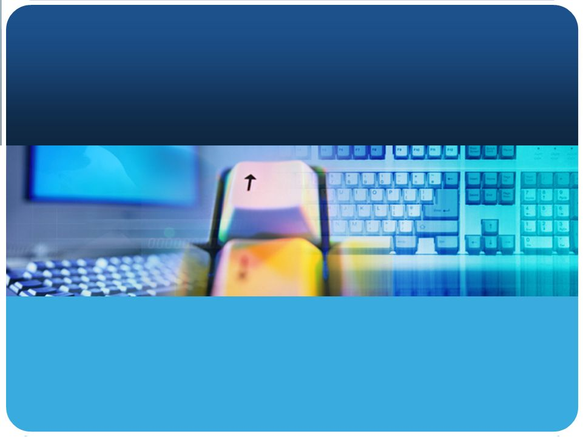

# 伊波研究室紹介

<!--
_class: lead
-->

## SecLab.
# 主な卒研テーマ1
- セキュリティ関連
  - Windowsマルウェア検知
  - マルウェア動的解析
  - DDoS攻撃対策
  - 機械学習を用いたセキュリティ対策
  - Webアプリのセキュリティ対策
# 主な卒研テーマ2
- ネットワーク関連
  - SDN(OpenFlow)によるシステム構築
  - ネットワーク侵入検知
# 主な卒研テーマ3
- Webアプリケ開発
  - セキュリティを考慮したWebアプリの構築
# 主な卒研テーマ4
- iOSやAndroidアプリ開発
- 自動車のセキュリティ
# 研究内容詳細1
- (1) Windows系OSにおける不正プログラム検知に関する研究
  - ウイルスやワームなどの不正なプログラムの検知に関する研究を行います。この研究では、プログラムがOSの機能を利用するために発行するシステムコールに着目し、プログラムがOS資源へアクセスする際の振る舞いにより不正プログラムと正常なプログラムを識別します。
# 研究内容詳細2
- (2) Webアプリケーションの開発とセキュリティに関する研究
  - 学内で使用する事務系のWebアプリケーション開発を通して、Webアプリケーションの開発におけるセキュリティ問題の解決法に関する研究を行います。また、Webアプリケーションの開発に不可欠となってきたフレームワークについて調査し、MVCアーキテクチャーに基づいたWebアプリケーションの開発技法を研究します。
# 研究内容詳細3
- (3) OpenFlowを用いたネットワークシステム開発に関する研究
  - OpenFlowと呼ばれる新しいネットワーク機器制御アーキテクチャーを用いて、新たな管理ツールやセキュリティツールの開発を通してネットワークについて研究します。スイッチなどの設定や管理などのネットワークに関する知識やネットワーク機器を制御する技術などを習得することができます。
# 研究内容詳細4
- (4) ネットワーク侵入検知に関する研究
  - ネットワーク上を流れるデータを集合知プログラミングの各種手法を用いて解析することにより、正常なアクセスと異常なアクセスを検知できるシステムについて研究します。
# 研究内容詳細5
- (5) 自動車のセキュリティに関する研究
  - 自動車もインターネットにつながる時代になり、セキュリティが重要となってきました。自動車内のネットワークはCANと呼ばれ、いろいろな攻撃手法が提案されています。それに対する対策について研究します
# 今年のテーマ
- 詐称されたIPアドレスを内部ネットワークから外部ネットワークへ流さない手法の提案
- 教師ありの学習となしの学習を組み合わせたハイブリッド型の検知システムの研究
- 機械学習によるプロセス構造に着目したIoTボット検知
- 画像化とAnoGANを用いたマルウエア検知に関する検討
- Webサイトの構築コストに基づくフィッシングサイト検出手法の提案

# 希望する学生
- 自らテーマを見つけて卒研に取り組む人
  - 私がテーマを与えることはありません
  - 一緒に考えながら自らテーマを見つけることが大切です
- 私の研究室ではセキュリティに関するテーマが中心になりますので、不正プログラムの作成技法や研究で身につけた攻撃手法などを悪用しない正しい技術者倫理を持っている人
# 最後に
- テーマについてはあくまでも例です。これ以外にやりたいテーマがあって私が対応できそうであれば相談して下さい。
- 選考方法
  - 研究室訪問を済ませていること。(この説明会への参加で可とする)
  - 必要であれば、4年次前期成績の選択以外の専門科目成績順を考慮します　
  →今年度は4年次前期の成績を使うのが難しいので、研究に対する取り組みや抱負などを書いてもらって判断します

# 退屈な会議、やめませんか？

<!--
_class: lead
 -->

# 画像編集ソフトで横並びに

# 表を使って横並びに

| A について                                    | B について                                    |
| --------------------------------------------- | --------------------------------------------- |
|  |  |

# 引用サンプル

〇〇が成り立つ$^{[1]}$

〇〇も成り立つ$^{[2]}$

> [1] https://example.com  
> [2] https://sub.example.com
